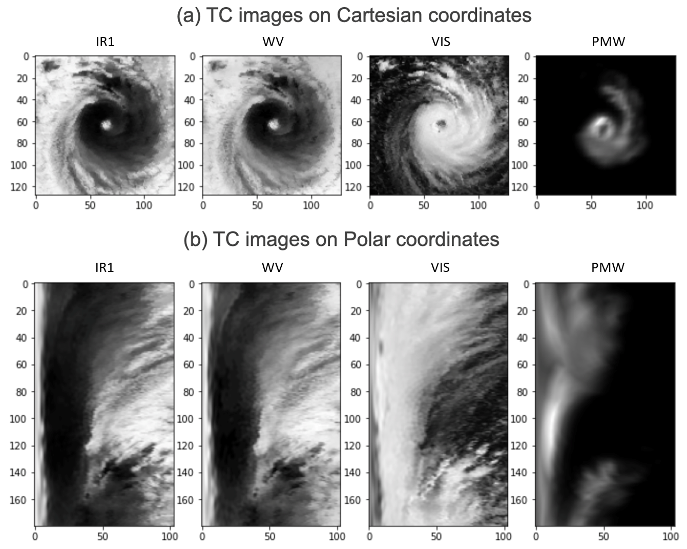
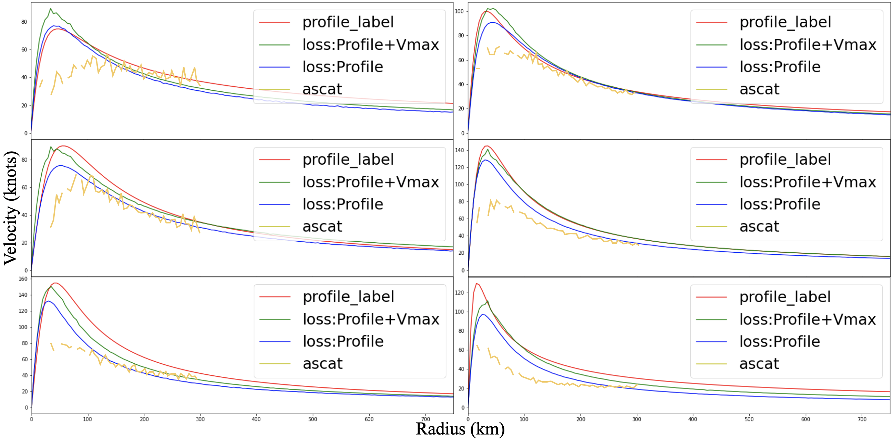
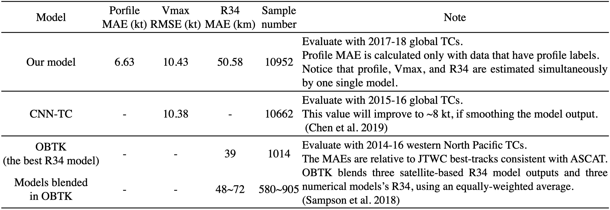

# CNN Profiler on Polar Coordinate Images for Tropical Cyclone Structure Analysis

This repository is the official implementation of CNN Profiler on Polar Coordinate Images for Tropical Cyclone Structure Analysis. 



## Requirements

To install requirements:

0. install pipenv (if you don't have it installed yet)
```setup
pip install pipenv
```
1. use pipenv to install dependencies:
```
pipenv install
```
2. install tensorflow **in the** pipenv shell
(choose compatible tensorflow version according to your cuda/cudnn version)
```
pipenv run pip install tensorflow
pipenv run pip install tensorflow_addons
```

## Training

To run the experiments in the paper, run this command:

```train
pipenv run python main.py train <experiment_path>

<experiment_path>:
experiments/profiler_experiments/structure_and_kernel.yml: To obtain the comparison between different kernel shapes (table 1 in the paper).

experiments/profiler_experiments/loss_combination.yml: To obtain the comparison between different factor combinations in the loss function (table 2 in the paper).
```

***Notice that due to the double bind review, only sample data are provided in the repository. Therefore, the reproduction of the experiments are temporally impossible.***

### Some usful aguments

#### To limit GPU usage
Add *GPU_limit* argument, for example:
```args
pipenv run python train main.py <experiment_path> --GPU_limit 3000
```

#### Continue from previous progress
An experiemnt is divided into several sub_exp's.
For example, a *loss_combination* experiment comprise 5 sub-exp's.

Once the experiemnt get interrupted, we probably want to continue from the completed part.
For example, when the *loss_combination* experiment get interrupted when executing sub-exp #3 (*loss:profile+R34*), we want to restart from the beginning of sub-exp #3 instead of sub-exp #1.

We can do this to save times:

1. Remove partially done experiment's log.
```
rm -r logs/test_loss_combination/loss:profile+R34/
```

2. Restart experiment with argument: *omit_completed_sub_exp*.
```
pipenv run python train main.py experiments/profiler_experiments/loss_combination.yml --omit_completed_sub_exp
```

## Evaluation

All the experiments are evaluated automaticly by tensorboard and recorded in the folder "logs".
We provide the completed logs of the *loss_combination* experiment.

To check the result:

```eval
pipenv run tensorboard --logdir logs

# If you're running this on somewhat like a workstation, you could bind port like this:
pipenv run tensorboard --logdir logs --port=1234 --bind_all
```

Validation score can be obtained from the **[valid] regressor: blending_loss** in the scalar tab.


## Results

### Case study



Our model achieves the following performance:


